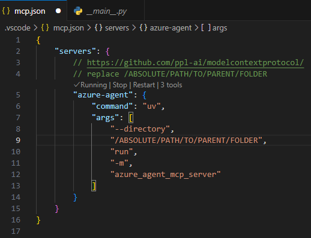

# Azure AI Agents and MCP Resources

Sources:
<https://devblogs.microsoft.com/foundry/integrating-azure-ai-agents-mcp/>
<https://code.visualstudio.com/docs/copilot/chat/mcp-servers>

Setup path and run server:


Add env vars to .env

Add tools to Github Copilot agent in Visual Studio Code:


Running the server standalone:

```shell
cd ../agents
source .venv/Scripts/activate
az login
uv run -m azure_agent_mcp_server
```
